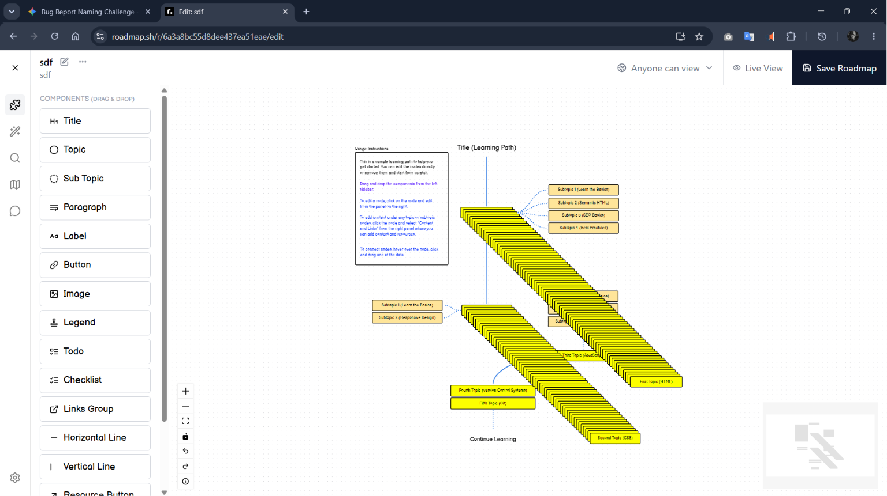

## Browser tab crashes due to lack of upper limit on node creation in custom roadmap editor

## Summary
Adding nodes repeatedly in the custom roadmap editor has no upper limit, causing severe performance degradation and eventually crashing the browser tab.

## Environment
- Browser: Chrome 125.0
- Os: Windows 11
- Account Type: Registered User

## Steps to Reproduce
1. Go to `https://roadmap.sh/roadmaps/create` and open the custom roadmap editor
2. Continuously add new nodes to the canvas without removing any
3. Continue adding nodes until browser performance noticeably degrades
4. Observe whether any node limit warning appears at any point

## Expected Behavior
The editor should either enforce a maximum node limit and display a graceful error message (e.g., "You've reached the maximum of X nodes"), or optimize rendering to handle a large number of nodes without crashing.

## Actual Behavior
No node limit exists. Adding nodes indefinitely causes the page to slow down progressively and ultimately crash the browser tab.

## Severity
[ ] Critical [ ] High [x] Medium [ ] Low

## Screenshots / Evidence

---
> Related test case: TC-CUSTOM-018
