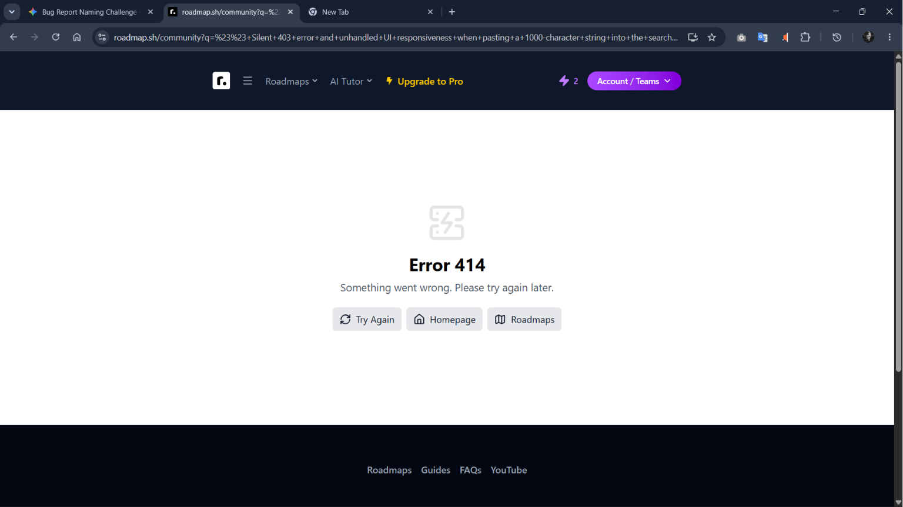

## Silent 403 error and unhandled UI responsiveness when pasting a 1000-character string into the search field

## Summary
Pasting a ~1000-character string into the Community Roadmap search field causes a silent 403 error with no user-facing feedback — the UI appears to do nothing.

## Environment
- Browser: Chrome 125.0
- Os: Windows 11
- Account Type: Registered User

## Steps to Reproduce
1. Go to `https://roadmap.sh/community`
2. Paste a ~10000-character string (e.g., repeat "abcdefghij" 100 times)
3. Press Enter or click the search button
4. Observe the UI response
5. Open DevTools → Network tab and check the response code for the search request

## Expected Behavior
The UI should either enforce a character limit and block submission, or return a friendly message such as "Your search term is too long. Please try a shorter query."

## Actual Behavior
The search request returns an HTTP 414 error from the server, but the UI displays no error message, loading state, or any feedback. The search bar simply appears unresponsive.

## Severity
[ ] Critical [ ] High [ ] Medium [x] Low

## Screenshots / Evidence
