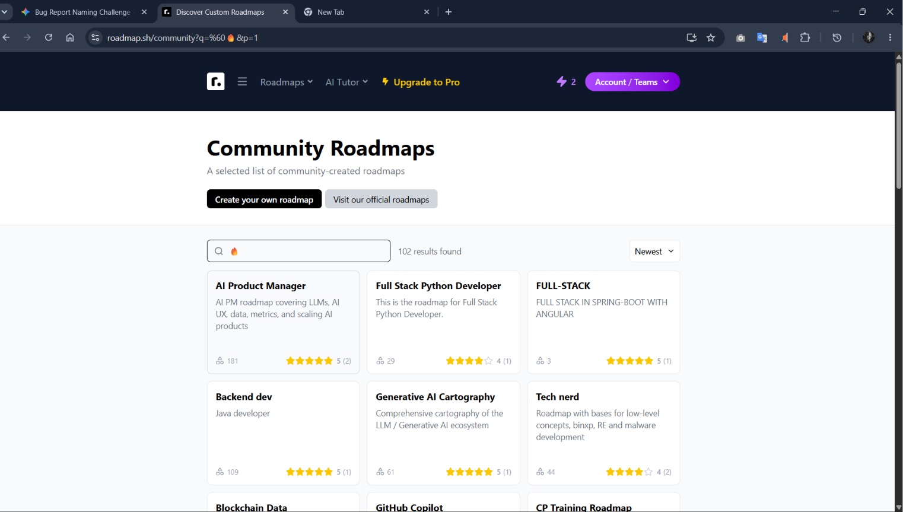

## Emoji search queries trigger catch-all search and return entire roadmap catalogue

## Summary
Typing emoji characters into the global search bar returns the entire roadmap catalogue instead of a "no results found" empty state.

## Environment
- Browser: Chrome 125.0
- Os: Windows 11
- Account Type: Registered User

## Steps to Reproduce
1. Go to `https://roadmap.sh/community`
2. Click the search bar in the top navigation
3. Type one or more emoji characters (e.g., `🔥`, `😀`, or `🎯🚀`)
4. Press Enter or wait for the search to trigger
5. Observe the results returned

## Expected Behavior
The search should return a "No results found" empty state, or a relevant subset of results if emoji input can be meaningfully interpreted. Returning the full roadmap catalogue is not expected for any specific query.

## Actual Behavior
The search returns every available roadmap as if no filter was applied. The emoji input appears to be stripped or ignored, causing the query to fall back to a blank/catch-all search.

## Severity
[ ] Critical [ ] High [ ] Medium [x] Low

## Screenshots / Evidence
