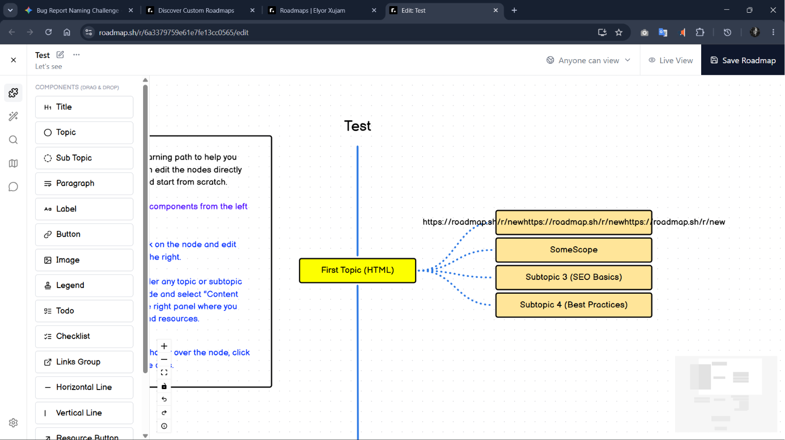

## Text overflows outside node boundaries when typing long strings in custom roadmap editor

## Summary
When a long text string is typed into a custom roadmap node, the node box does not resize to fit the content — the text overflows and spills outside the node boundary.

## Environment
- Browser: Chrome 125.0
- Os: Windows 11
- Account Type: Registered User

## Steps to Reproduce
1. Go to `https://roadmap.sh/roadmaps` and open the custom roadmap editor
2. Add a new node to the canvas or click an existing node to edit it
3. Type a long label into the node — e.g., "Understanding the fundamentals of asynchronous JavaScript including Promises, async/await, and the event loop"
4. Click away from the node to deselect it
5. Observe the rendered node on the canvas

## Expected Behavior
The node box should auto-expand vertically (or wrap text within a fixed width) to fully contain the entered text. The node label should remain fully readable within its boundaries at all times.

## Actual Behavior
The node box stays at its original fixed size. Long text overflows outside the node boundary, overlapping the canvas and potentially other nearby nodes, making the content partially or fully illegible.

## Severity
[ ] Critical [ ] High [ ] Medium [x] Low

## Screenshots / Evidence
